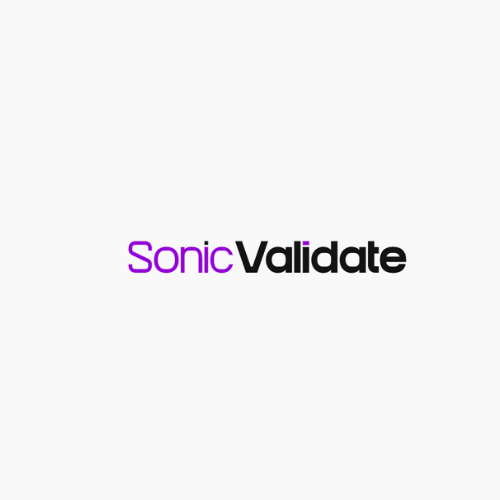

# Sonic Validate ⚡

Sonic validate is a input (body) validation library for [Golang](https://golang.org/). It can be use as a middleware for HTTP frameworks like:

- [Go Fiber](https://docs.gofiber.io/)
- [Gin](https://gin-gonic.com/)
- [Echo](https://github.com/labstack/echo)

## The concept

You first create a validation schema, then you pass the schema to the validator. The validator will return a function that can be used as a middleware.

The `schema` is a map of `string` and `interface{}`. The `string` is the name of the field and the `interface{}` is the validation rule.

The `schema` can be store in a file or in a database. The `schema` can be use for multiple validation.
